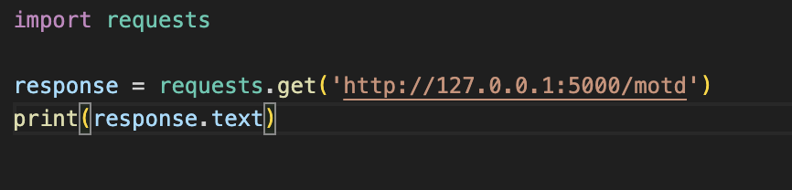
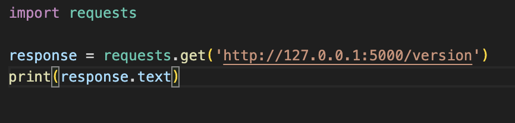
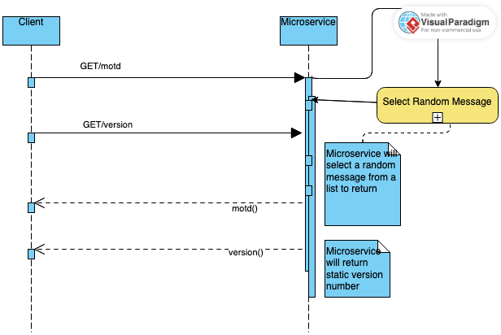

MICROSERVICE PROJECT FOR TODO DESKTOP APP

This microservice is implememnted using Python and Flask to provide a Message of the Day (motd) and a version number for a desktop TODO desktop application.

---------------
INSTRUCTIONS:
---------------
Requesting Data
---------------
- Message of the Day (motd) Endpoint:
    - Method: Get
    - URL: /motd
    - Example call:

- Version Endpoint:
    - METHOD: GET
    - URL: /version
    - Example call:

---------------
RECIEVING DATA
---------------
- motd Endpoint: 
    - Returns a random message from a list
- Version Endpoint:
    - Returns the current version of the microservice "v1.0.0"

---------------------
UML SEQUENCE DIAGRAM:
---------------------

